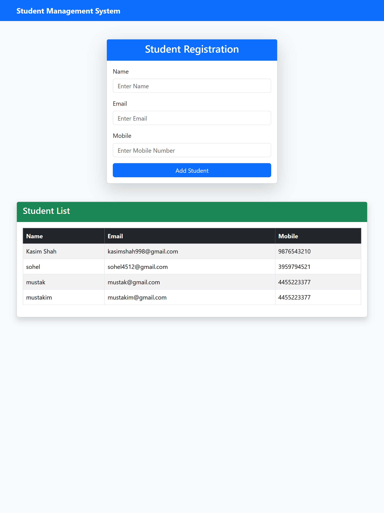
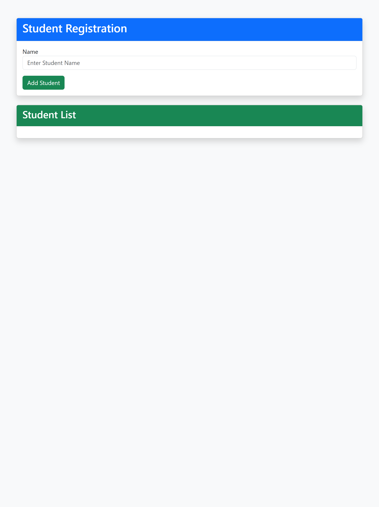
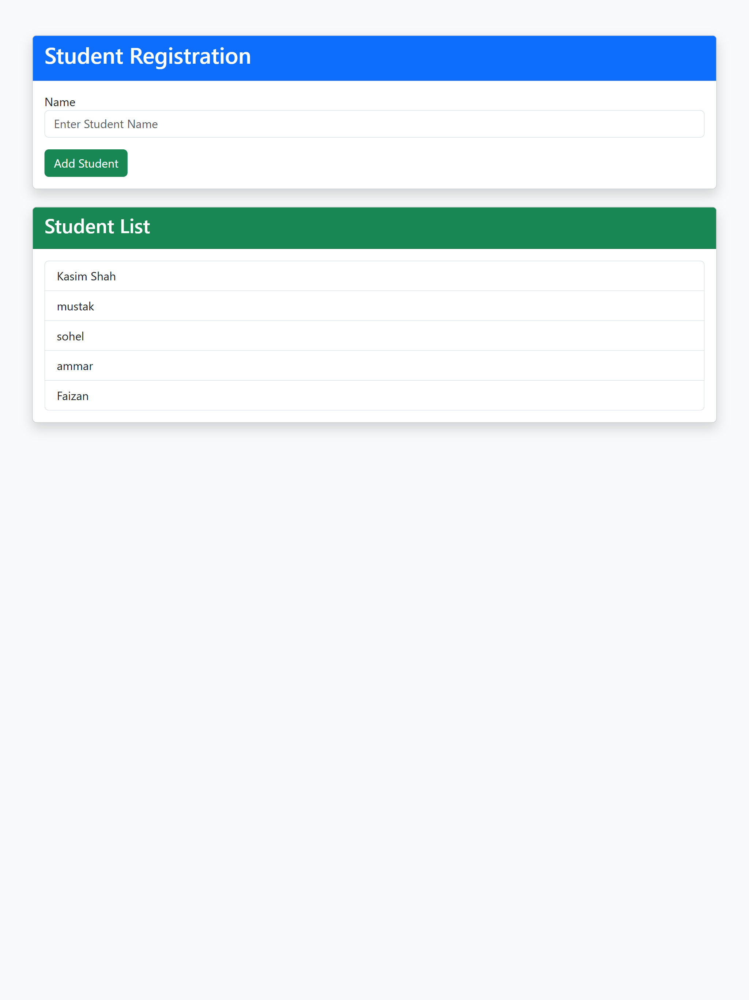
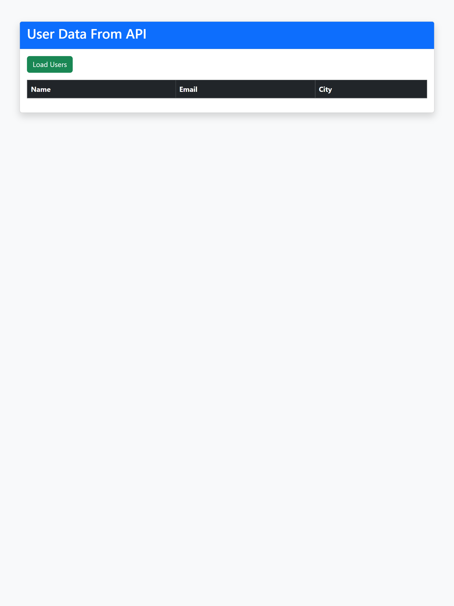
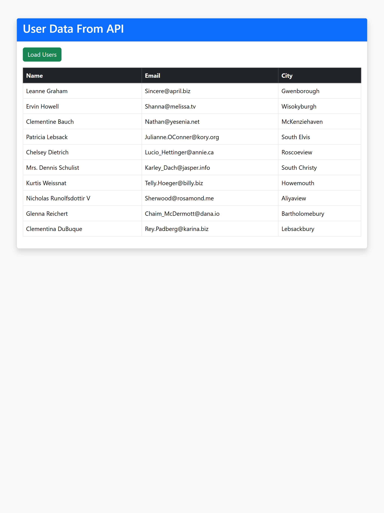

<p align="center">
  
  
  
  
  
</p>


# 🎓 Student Management System

A modern Student Management System developed using **Node.js**, **Express.js**, **EJS**, **Bootstrap** and **JavaScript**.

This project was developed during my **Full Stack Development Internship**.

---

# 🚀 Features

- Student Registration
- Name Validation
- Email Validation
- Mobile Validation
- Responsive Bootstrap UI
- Dynamic DOM Manipulation
- API Integration
- Student List
- Clean Interface
- Easy to Use

---

# 🛠 Technologies Used

- HTML5
- CSS3
- Bootstrap 5
- JavaScript
- Node.js
- Express.js
- EJS

---

# 📂 Project Structure

```
FullStack_Internship_Project

│

├── Task1_2_3

│ ├── server.js

│ ├── package.json

│ ├── views

│ └── public

│

├── Task4

│ └── index.html

│

├── Task5

│ └── index.html

│

└── README.md
```

---

# ⚙ Installation

Clone Repository

```bash
git clone https://github.com/kasimshah19/FullStack_Internship_Project.git
```

Go inside folder

```bash
cd FullStack_Internship_Project
```

Install Packages

```bash
npm install
```

Run Project

```bash
node server.js
```

---

## 📸 Project Screenshots

### 🏠 Home Page



---

### ⚡ DOM Manipulation





---

### 🌐 API Integration





# 🌐 Live Demo

Coming Soon...

---

# 🎯 Future Improvements

- MongoDB Database
- Login System
- Authentication
- Admin Dashboard
- Delete Student
- Update Student
- Search Student

---

# 👨‍💻 Author

Kasim Shah

GitHub

https://github.com/kasimshah19

---

# ⭐ If you like this project

Give this repository a ⭐ on GitHub. 
